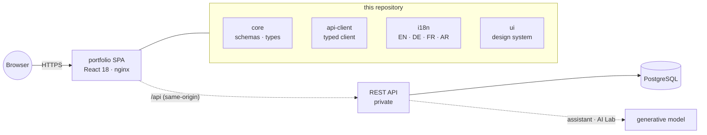

<div align="center">


<br/>

<a href="https://github.com/A7med-Sghaier/my-portfolio">
  
</a>

<br/><br/>

[](https://github.com/A7med-Sghaier/my-portfolio/actions/workflows/ci.yml)
[](https://react.dev)
[](https://www.typescriptlang.org)
[](https://vite.dev)
[](https://tailwindcss.com)


<br/>

**[Live site — a7med-sghaier.app](https://a7med-sghaier.app)** · [AI Lab](https://a7med-sghaier.app/ai-lab) · [Résumé](https://a7med-sghaier.app/resume)

<sub>The “Ask my portfolio” assistant is available from every page of the live site.</sub>

</div>

The public single-page application behind **[a7med-sghaier.app](https://a7med-sghaier.app)**, together with the shared packages it is built from: the design system, the domain schemas, the locale catalogues, and the typed API client.

The site is a React 18 SPA served as a static bundle. All content — profile, experience, projects, expertise, and the interface copy itself — is fetched from a REST API at runtime. It is published in four languages (English, German, French, Arabic) with full right-to-left support, and includes two features backed by a generative model: an assistant that answers questions about my background, and a lab that drafts a project case study from any public GitHub repository.

> [!NOTE]
> There is no mocked runtime data. Every page is driven by the live API, so a local checkout exercises the same code path that serves production.

<div align="center"></div>

## Contents

- [Gallery](#gallery)
- [Features](#features)
- [AI features](#ai-features)
- [Repository scope](#repository-scope)
- [Architecture](#architecture)
- [Getting started](#getting-started)
- [Quality gates](#quality-gates)
- [Documentation](#documentation)
- [License](#license)

<div align="center"></div>

## Gallery

|                                                                                       |                                                                                       |
| ------------------------------------------------------------------------------------- | ------------------------------------------------------------------------------------- |
| **Home** — aurora hero, cursor spotlight, live status console                         | **Projects** — case-study grid driven by the API                                      |
|            |         |
| **Case study** — metrics, architecture, evidence, live repository metadata            | **Ask my portfolio** — answers grounded in published content                          |
|  |  |

<div align="center"></div>

## Features

**Four locales with full RTL.** English, German, French, and Arabic, including right-to-left layout. A key-parity assertion in the test suite fails the build when a string is added to one locale and not the others, and the interface copy can be overridden at runtime through the API without a redeploy.

**API-driven content.** Every content surface is fetched at runtime and edited through a separate studio, so publishing does not require a deployment.

**Detailed project pages.** Each case study carries performance metrics, an architecture diagram, evidence links, and repository metadata synchronised from GitHub.

**Motion and accessibility.** A shared motion system that honours `prefers-reduced-motion`, a keyboard command palette, and semantic, focus, contrast, and screen-reader review supported by an accessibility addon in Storybook.

**Client-side résumé export.** A PDF résumé generated in the browser from the same live content.

<div align="center"></div>

## AI features

### Ask my portfolio

A chat widget that answers visitor questions about experience, projects, skills, education, and availability, in any of the four site locales.

| Property           | Behaviour                                                                                                                                                                                         |
| ------------------ | ------------------------------------------------------------------------------------------------------------------------------------------------------------------------------------------------- |
| **Grounding**      | The model receives only published content — draft, hidden, and private records are filtered out beforehand — under a prompt that forbids inventing employers, projects, metrics, or availability. |
| **Degraded path**  | If the model errors or times out, the API returns `502` and the widget answers from `answerPortfolioQuestion`, a deterministic multilingual keyword matcher over the same content.                |
| **Abuse controls** | Rate-limited per IP address, with questions capped at 500 characters.                                                                                                                             |

The fallback is a designed path with its own test coverage, not an error state: a model outage reduces answer quality rather than removing the feature.

### AI Lab

A public view of the content studio's repository-intake pipeline. Submitting a public GitHub repository runs the same **fetch → extract → generate → review** flow the studio uses, streamed stage by stage, and returns a draft case study.

- Submitted repositories and generated drafts are **not stored**; each run is transient.
- The pipeline completes even with no generator available: extraction falls back to a heuristic and the result is marked as extracted rather than generated.
- Output is presented for review and is never applied to content automatically.

Both features are documented in [docs/architecture/portfolio-assistant.md](docs/architecture/portfolio-assistant.md).

<div align="center"></div>

## Repository scope

This repository contains the browser application and the packages that define the contract between browser and server.

| Workspace             | Contents                                                                 |
| --------------------- | ------------------------------------------------------------------------ |
| `apps/portfolio`      | The public single-page application                                       |
| `packages/core`       | Domain types and zod validation schemas — the contract at every boundary |
| `packages/api-client` | The typed browser API client; no runtime dependencies                    |
| `packages/i18n`       | Locale catalogues, helpers, and the key-parity guard                     |
| `packages/ui`         | Design-system primitives with Storybook coverage                         |

### What is not included

The REST API, the admin content studio, the PostgreSQL schema and migrations, and the deployment pipeline are maintained in a separate private repository. That code operates the live service and is **proprietary, all rights reserved**. It is not distributed and is not covered by the MIT licence that applies to this repository. Keeping the service private also places its operational surface — content pipeline, credentials, and deployment topology — outside the scope of a public portfolio project.

The split is practical because of `packages/api-client`. It carries the complete typed surface of the API and imports only _types_ from `packages/core`, giving it no runtime dependencies. Both halves therefore share one contract without duplicating it, and no server-side code can reach a browser bundle through it.

## Architecture



The application is deployed as a static bundle behind an edge proxy that forwards `/api` to the API. Requests therefore remain same-origin and authentication cookies stay first-party. The container image is built by this repository's CI and published to the GitHub Container Registry, from which the private deployment consumes it by tag.

<div align="center"></div>

## Getting started

**Requirements:** Node.js 20.11 or later (22 LTS via `.nvmrc`) and pnpm 9.15.

```sh
pnpm install
pnpm dev
```

The development server listens on `http://127.0.0.1:4173`.

### Selecting an API

`VITE_API_URL` determines where requests are sent (see `apps/portfolio/.env.example`):

| Value             | Behaviour                                                                                          |
| ----------------- | -------------------------------------------------------------------------------------------------- |
| _empty_ (default) | Requests go to the serving origin's `/api`; the dev server proxies them to `VITE_API_PROXY_TARGET` |
| An absolute URL   | Requests go directly to that API                                                                   |

Because the public endpoints require no authentication, pointing the application at the production API renders the real site content from a fresh checkout, including both AI features:

```sh
VITE_API_URL=https://a7med-sghaier.app pnpm dev
```

## Quality gates

```sh
pnpm lint            # ESLint across apps and packages
pnpm typecheck       # strict TypeScript everywhere
pnpm test            # Vitest unit suites
pnpm build           # production build
pnpm storybook       # design-system workbench
```

Continuous integration runs formatting, lint, typecheck, unit tests, the production build, and a Storybook build on every push and pull request.

> [!IMPORTANT]
> `packages/core` and `packages/api-client` are consumed from their compiled `dist/`, so `pnpm build:packages` must run before linting or type-checking. The root `dev`, `test`, and `typecheck` scripts do this automatically.

## Documentation

|                                                                                             |                                                               |
| ------------------------------------------------------------------------------------------- | ------------------------------------------------------------- |
| [ADR-001 — application architecture](docs/architecture/ADR-001-application-architecture.md) | [System overview](docs/architecture/system-overview.md)       |
| [Portfolio assistant & AI Lab](docs/architecture/portfolio-assistant.md)                    | [Content publishing](docs/architecture/content-publishing.md) |
| [Design system](docs/design/design-system.md)                                               | [Accessibility](docs/design/accessibility.md)                 |
| [Responsive strategy](docs/design/responsive-strategy.md)                                   | [Testing](docs/development/testing.md)                        |
| [Storybook](docs/development/storybook.md)                                                  |                                                               |

## Project status

This is a personal project that backs a live site. It is published as a reference implementation rather than as a general-purpose template, and it is not seeking contributions. Issues reporting a genuine defect are welcome.

<div align="center">


**Ahmed Sghaier** · Senior Full-Stack Engineer
[a7med-sghaier.app](https://a7med-sghaier.app) · [GitHub](https://github.com/A7med-Sghaier) · [LinkedIn](https://www.linkedin.com/in/ahmed-sghaier-449778137)

</div>

## License

This repository is released under the [MIT License](LICENSE). The private server-side platform described in [Repository scope](#repository-scope) is not covered by that licence and remains proprietary.
