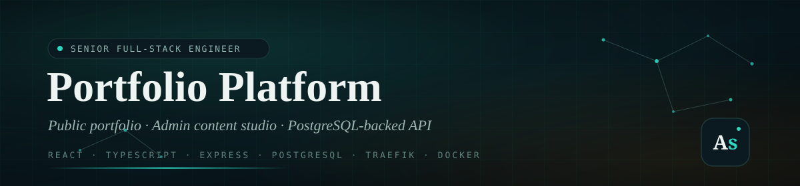
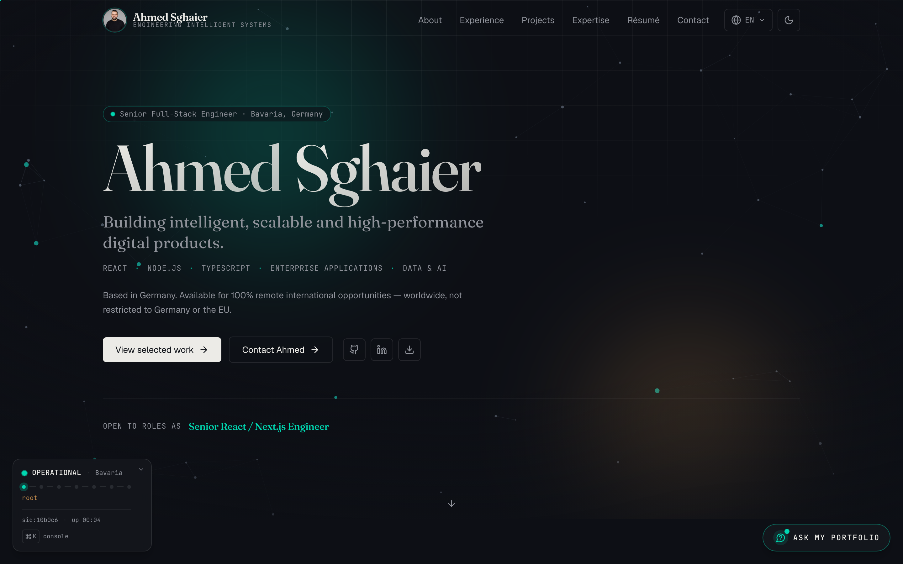
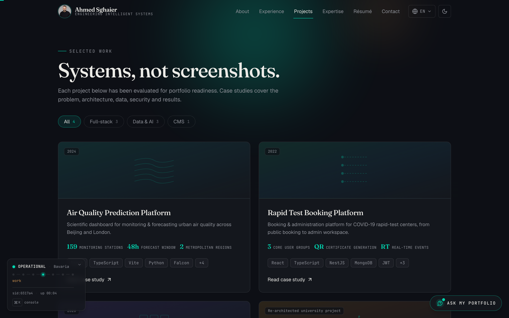
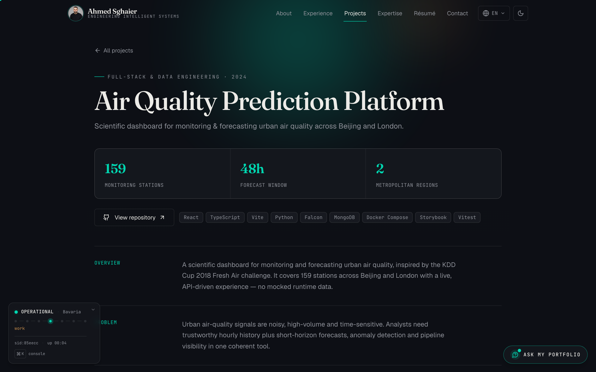
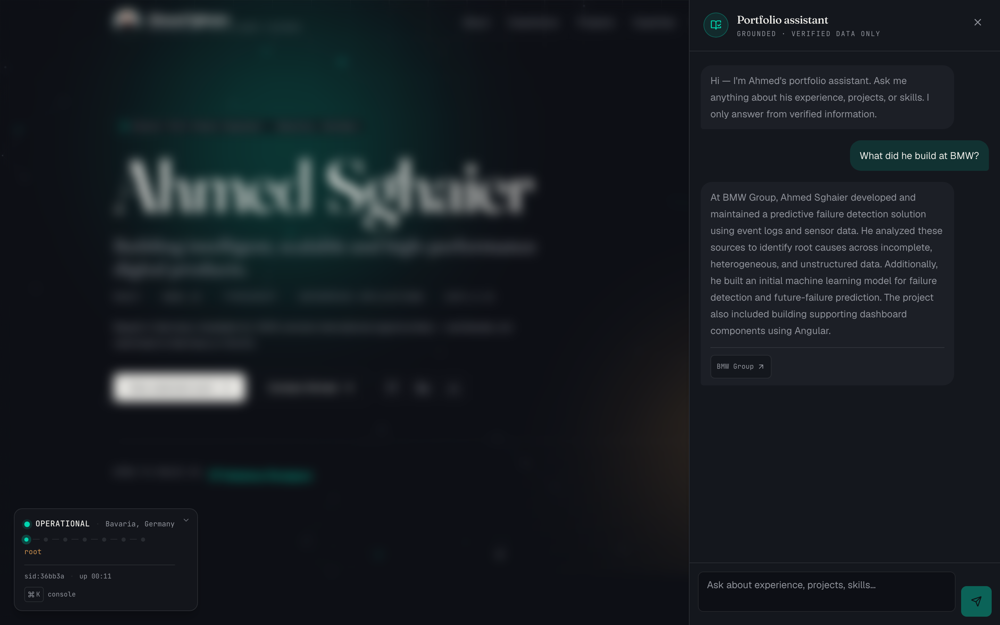
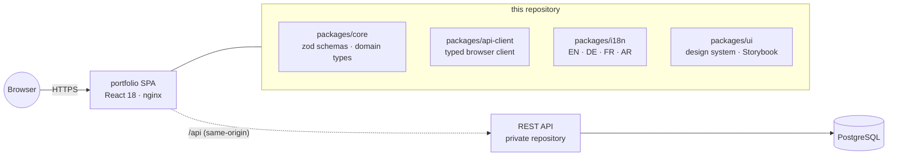

<div align="center">



<br/>

<a href="https://github.com/A7med-Sghaier/my-portfolio">
  
</a>

<br/><br/>

[](https://github.com/A7med-Sghaier/my-portfolio/actions/workflows/ci.yml)
[](https://react.dev)
[](https://www.typescriptlang.org)
[](https://vite.dev)
[](https://tailwindcss.com)


</div>

The **public site** of a production personal platform: a React 18 single-page
application driven entirely by a live REST API, speaking **four languages**
(EN · DE · FR · AR) with **full RTL** support, and answering visitor questions
through a **grounded AI assistant** that degrades to a deterministic keyword
matcher rather than ever going dark. This repository also holds the shared
**design system**, **domain schemas**, **locale catalogues**, and **typed API
client** the platform is built from.

> [!NOTE]
> There is **no mocked runtime data**. Every page — profile, experience,
> projects, expertise, and UI copy — is fetched from the API at runtime, so what
> you see running locally is the same code path that serves production.

<div align="center"></div>

## Gallery

|                                                                                       |                                                                                       |
| ------------------------------------------------------------------------------------- | ------------------------------------------------------------------------------------- |
| **Public portfolio** — aurora hero, cursor spotlight, live status console             | **Projects** — case-study grid driven by the API                                      |
|            |         |
| **Case study** — metrics, architecture, evidence, live GitHub sync                    | **Portfolio assistant** — grounded in published content only                          |
|  |  |

<div align="center"></div>

## Architecture



| Workspace             | What it is                                                                                                                                                          |
| --------------------- | ------------------------------------------------------------------------------------------------------------------------------------------------------------------- |
| `apps/portfolio`      | Public site — React 18 + Vite + Tailwind 4, React Router 7 data routers, four locales, AI assistant, live AI Lab, motion system, command palette, PDF résumé export |
| `packages/core`       | Shared domain types and zod validation schemas — the contract at every boundary                                                                                     |
| `packages/api-client` | The typed browser API client. Zero runtime dependencies; imports only _types_ from `core`                                                                           |
| `packages/i18n`       | Locale catalogues and helpers, with a key-parity assertion guarding all four languages                                                                              |
| `packages/ui`         | Design-system primitives with Storybook coverage and accessibility addon                                                                                            |

### Why the client is its own package

`packages/api-client` is the seam between browser and server. It carries the
full typed surface of the API and **no runtime dependencies** — it imports only
types from `core`, so nothing server-side can leak into a browser bundle through
it. That property is what lets the public application and the private API live in
different repositories without either duplicating the contract.

### The assistant never goes dark

`POST /api/assistant/ask` returns a model answer grounded in the published
content the site already renders — draft, hidden, and private records are
filtered out before the model ever sees them. When the model errors or times
out, the endpoint returns `502` and the widget falls back to
`answerPortfolioQuestion`, a deterministic multilingual keyword matcher over the
same facts. The degraded path is a **designed** path, not an accident, and it is
covered by tests. Details in
[docs/architecture/portfolio-assistant.md](docs/architecture/portfolio-assistant.md).

<div align="center"></div>

## Quick start

Requirements: Node.js 20.11+ (22 LTS via `.nvmrc`) and pnpm 9.15.

```sh
pnpm install
pnpm dev
```

The site starts on `http://127.0.0.1:4173`.

Point it at an API with `VITE_API_URL` (see `apps/portfolio/.env.example`):

| Value             | Behaviour                                                                                  |
| ----------------- | ------------------------------------------------------------------------------------------ |
| _empty_ (default) | Calls go to the serving origin's `/api`; the dev server proxies to `VITE_API_PROXY_TARGET` |
| An absolute URL   | Calls go directly to that API                                                              |

Because the public endpoints are public, pointing `VITE_API_URL` at the live
production API renders the real site content on a fresh clone.

## Quality gates

```sh
pnpm lint            # ESLint across apps and packages
pnpm typecheck       # strict TypeScript everywhere
pnpm test            # Vitest unit suites
pnpm build           # production build
pnpm storybook       # design-system workbench
```

CI runs formatting, lint, typecheck, unit tests, the production build, and a
Storybook build on every push and pull request.

## Repository structure

```text
apps/portfolio        Public single-page application
packages/core         Domain types and zod schemas
packages/api-client   Typed browser API client
packages/i18n         EN · DE · FR · AR catalogues
packages/ui           Design-system components + Storybook
docs/architecture     Decision records and feature designs
docs/design           Design system, accessibility, responsive strategy
docker/nginx          Static-runtime server configuration
```

## Related

The REST API, the admin content studio, the PostgreSQL schema and migrations,
and the deployment pipeline live in a separate private repository. This
repository is consumed there as a submodule, and its container image is built
here and published to GHCR.

## Documentation

|                                                                                             |                                                               |
| ------------------------------------------------------------------------------------------- | ------------------------------------------------------------- |
| [ADR-001 — application architecture](docs/architecture/ADR-001-application-architecture.md) | [System overview](docs/architecture/system-overview.md)       |
| [Portfolio assistant](docs/architecture/portfolio-assistant.md)                             | [Content publishing](docs/architecture/content-publishing.md) |
| [Design system](docs/design/design-system.md)                                               | [Accessibility](docs/design/accessibility.md)                 |
| [Responsive strategy](docs/design/responsive-strategy.md)                                   | [Testing](docs/development/testing.md)                        |
| [Storybook](docs/development/storybook.md)                                                  |                                                               |

<div align="center">


**Ahmed Sghaier** · Senior Full-Stack Engineer
[a7med-sghaier.app](https://a7med-sghaier.app) · [GitHub](https://github.com/A7med-Sghaier) · [LinkedIn](https://www.linkedin.com/in/ahmed-sghaier-449778137)

</div>

## License

Released under the [MIT License](LICENSE).
