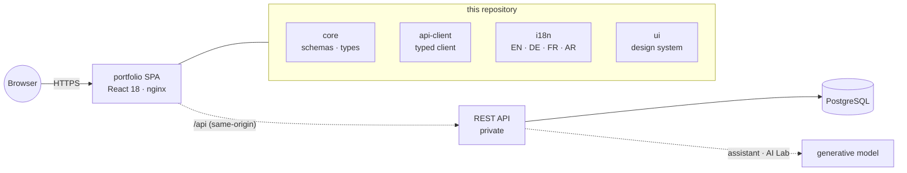

<div align="center">


<br/>

<a href="https://github.com/A7med-Sghaier/my-portfolio">
  
</a>

<br/><br/>

[](https://github.com/A7med-Sghaier/my-portfolio/actions/workflows/ci.yml)
[](https://react.dev)
[](https://www.typescriptlang.org)
[](https://vite.dev)
[](https://tailwindcss.com)


</div>

The **public site** of my personal engineering platform, live at
**[a7med-sghaier.app](https://a7med-sghaier.app)**. A React 18 single-page
application driven entirely by a live REST API, speaking **four languages**
(EN · DE · FR · AR) with **full RTL**, and shipping two AI features you can try
without an account: an assistant that answers questions about my work, and a
**live AI Lab** that drafts a case study from any public GitHub repository while
you watch. This repository also holds the shared **design system**, **domain
schemas**, **locale catalogues**, and **typed API client** the platform is built
from.

> [!NOTE]
> There is **no mocked runtime data**. Every page — profile, experience,
> projects, expertise, and even the UI copy — is fetched from the API at
> runtime, so what you run locally is the same code path that serves production.

<div align="center"></div>

## Gallery

|                                                                                       |                                                                                       |
| ------------------------------------------------------------------------------------- | ------------------------------------------------------------------------------------- |
| **Public portfolio** — aurora hero, cursor spotlight, live status console             | **Projects** — case-study grid driven by the API                                      |
|            |         |
| **Case study** — metrics, architecture, evidence, live GitHub sync                    | **Ask my portfolio** — grounded in published content only                             |
|  |  |

<div align="center"></div>

## What it does

- **Four locales, properly.** EN · DE · FR · AR with full right-to-left layout —
  not a machine-translated afterthought. A key-parity assertion in the test
  suite fails the build if a string lands in one language and not the others.
- **Content-driven.** Profile, experience, projects, expertise and UI copy all
  come from the API, so the site is edited through a studio rather than a
  redeploy.
- **Case studies, not screenshots.** Each project page carries metrics,
  an architecture diagram, evidence links, and live repository metadata.
- **Considered motion and accessibility.** A shared motion system that honours
  `prefers-reduced-motion`, a keyboard command palette, and semantic/contrast
  review backed by an accessibility addon in Storybook.
- **PDF résumé export** generated client-side from the same live content.

<div align="center"></div>

## The two AI features

### Ask my portfolio

A chat widget that answers visitor questions about my experience, projects,
skills, education, and availability — in whichever of the four languages you ask.

What makes it trustworthy rather than a demo:

- **It only sees published content.** The model receives exactly what the site
  renders; draft, hidden, and private records are filtered out before the
  request is built, under a system prompt that forbids inventing employers,
  projects, metrics, or availability.
- **It never goes dark.** When the model errors or times out, the API returns
  `502` and the widget falls back to `answerPortfolioQuestion`, a deterministic
  multilingual keyword matcher over the same facts. The degraded path is a
  _designed_ path with its own tests — not an accident.
- **It is abuse-limited.** Rate-limited per IP, with questions capped at 500
  characters.

### AI Lab

A public window into the studio's repository-intake pipeline. Paste any public
GitHub repository and watch the same **fetch → extract → generate → review**
flow the admin uses produce a draft case study, stage by stage, streamed live.

It is the honest version of an AI feature demo: you supply the input, you see
each stage as it runs, and you see the reviewed draft rather than a polished
result. **Nothing you submit is stored.** When no generator is reachable the
pipeline still completes — extraction falls back to a heuristic, and the draft
is marked as extracted rather than generated.

Both features are documented in
[docs/architecture/portfolio-assistant.md](docs/architecture/portfolio-assistant.md).

<div align="center"></div>

## What is here, and what is not

This repository is the **public half** of the platform. It contains everything
that runs in the visitor's browser, plus the packages that define the contract
between browser and server:

| Workspace             | What it is                                                               |
| --------------------- | ------------------------------------------------------------------------ |
| `apps/portfolio`      | The public single-page application                                       |
| `packages/core`       | Domain types and zod validation schemas — the contract at every boundary |
| `packages/api-client` | The typed browser API client. Zero runtime dependencies                  |
| `packages/i18n`       | Locale catalogues and helpers, with the key-parity guard                 |
| `packages/ui`         | Design-system primitives with Storybook coverage                         |

The **server side is deliberately not open-sourced**: the REST API, the admin
content studio, the PostgreSQL schema and migrations, and the deployment
pipeline live in a separate private repository. That code runs my live site and
is **proprietary — all rights reserved**; it is not offered under the MIT licence
that covers this repository, and it is not distributed. Publishing the client
while keeping the service private also keeps the operational surface (content
pipeline, credentials, deployment topology) out of scope for a portfolio
project.

That split is why `packages/api-client` exists as its own package. It carries
the full typed surface of the API and **no runtime dependencies** — it imports
only _types_ from `core` — so the public application and the private service can
live in different repositories without either duplicating the contract, and
nothing server-side can reach a browser bundle through it.

### Architecture



The SPA is served as a static bundle; the serving edge proxies `/api` to the API
so credentialed requests stay same-origin and cookies stay first-party.

<div align="center"></div>

## Quick start

Requirements: Node.js 20.11+ (22 LTS via `.nvmrc`) and pnpm 9.15.

```sh
pnpm install
pnpm dev
```

The site starts on `http://127.0.0.1:4173`.

`VITE_API_URL` selects the backend (see `apps/portfolio/.env.example`):

| Value             | Behaviour                                                                                  |
| ----------------- | ------------------------------------------------------------------------------------------ |
| _empty_ (default) | Calls go to the serving origin's `/api`; the dev server proxies to `VITE_API_PROXY_TARGET` |
| An absolute URL   | Calls go directly to that API                                                              |

Since the public endpoints are public, pointing `VITE_API_URL` at the live
production API renders the real site content on a fresh clone — including the
assistant and the AI Lab.

## Quality gates

```sh
pnpm lint            # ESLint across apps and packages
pnpm typecheck       # strict TypeScript everywhere
pnpm test            # Vitest unit suites
pnpm build           # production build
pnpm storybook       # design-system workbench
```

CI runs formatting, lint, typecheck, unit tests, the production build, and a
Storybook build on every push and pull request.

## Documentation

|                                                                                             |                                                               |
| ------------------------------------------------------------------------------------------- | ------------------------------------------------------------- |
| [ADR-001 — application architecture](docs/architecture/ADR-001-application-architecture.md) | [System overview](docs/architecture/system-overview.md)       |
| [Portfolio assistant & AI Lab](docs/architecture/portfolio-assistant.md)                    | [Content publishing](docs/architecture/content-publishing.md) |
| [Design system](docs/design/design-system.md)                                               | [Accessibility](docs/design/accessibility.md)                 |
| [Responsive strategy](docs/design/responsive-strategy.md)                                   | [Testing](docs/development/testing.md)                        |
| [Storybook](docs/development/storybook.md)                                                  |                                                               |

<div align="center">


**Ahmed Sghaier** · Senior Full-Stack Engineer
[a7med-sghaier.app](https://a7med-sghaier.app) · [GitHub](https://github.com/A7med-Sghaier) · [LinkedIn](https://www.linkedin.com/in/ahmed-sghaier-449778137)

</div>

## License

The contents of **this repository** are released under the
[MIT License](LICENSE). The private server-side platform described above is not
covered by it and remains proprietary.
