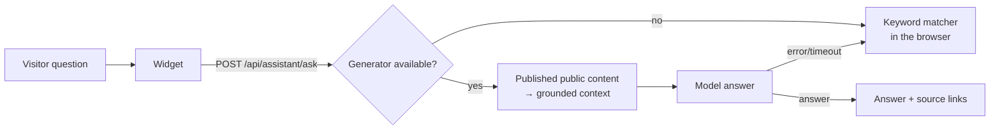

# Portfolio assistant — answering architecture

The public site's "Ask my portfolio" widget answers visitor questions about
experience, projects, skills, education, and availability. It is backed by a
generative model served by the API, with a deterministic client-side keyword
matcher as the always-available last resort.

This repository contains the widget and the fallback. The server-side generator
and its model configuration live in the private platform repository.

## Pipeline

Guarantees, in order of importance:

1. **Verified data only.** The model receives the same published content the
   site renders — draft, hidden, and private items are filtered out — and a
   system prompt that forbids inventing employers, projects, metrics, or
   availability.
2. **The assistant is optional.** Whenever the generator is unavailable, errors,
   or times out, `/api/assistant/ask` returns `502 assistant_failed` and the
   widget falls back to the deterministic keyword matcher. A 502 there is an
   expected degraded path, not an outage — the site never loses the feature.
3. **Abuse-limited.** The endpoint is IP rate-limited and questions are capped
   at 500 characters.

## Components in this repository

| Piece    | Location                                                | Responsibility                                                        |
| -------- | ------------------------------------------------------- | --------------------------------------------------------------------- |
| Widget   | `apps/portfolio/src/components/portfolio-assistant.tsx` | Chat sheet; calls the API, shows a thinking state, falls back locally |
| Fallback | `apps/portfolio/src/lib/portfolio-assistant.ts`         | Deterministic multilingual keyword matcher over portfolio facts       |
| Client   | `packages/api-client`                                   | Typed `askAssistant` request and error mapping                        |

The fallback is not a stub. It is a grounded matcher over the same public
content the site renders, written to answer the questions visitors actually ask,
so a model outage degrades the response quality rather than the feature.

## Locales

The endpoint accepts the site locale (`en`, `de`, `fr`, `ar`) and instructs the
model to answer in that language unless the question is clearly written in
another one. The fallback matcher is multilingual across the same four locales.
